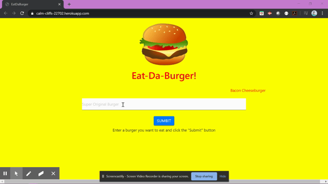

# [Eat-Da-Burger!](https://asuleigh.github.io/EatDaBurger)
A burger logger created with MySQL, Node, Express, Handlebars and a homemade ORM.

### Links
[Eat-Da-Burger Heroku](https://asuleigh.github.io/EatDaBurger/)
 
[Eat-Da-Burger GitHub](https://asuleigh.github.io/EatDaBurger/)
 
[GitHub Repo](https://github.com/asuleigh/EatDaBurger)

### GIF

ABSTRACT: This is a simple app built with MySQL, Node, Express, Express-Handlebars, and a homemade ORM. This app uses Node and mySQL to query and route data into the app, while Handlebars generates the html. The app allows the user to keep track of burgers they have eaten. The user starts by inputting a burger to eat and clicking submit, then burger is logged above the input on the left with a new button ("DEVOUR IT!"). Once the user clicks the "DEVOUR IT!" button, the burger posts as a "devoured" burger to the right with no further actions available aside from adding a new burger to devour.

Table of Contents:

i: Installation and Usage ii: Credits iii: License

i: INSTALLATION AND USAGE
-In order to clone or download website for functionality on local drives, be sure to install files to proper locations.

-Clone all repo files to your local computer

-Open the terminal and npm install (be sure to npm install the dependencies listed in server.js {mysql, express, express-handlebars, body-parser, and method-override})

-Run schema.sql in mySQL

-Run 'node server.js' in the terminal and you can start working with your new burger tracking app!

ii: CREDITS -https://www.npmjs.com/package/express -https://www.npmjs.com/package/body-parser -https://www.npmjs.com/package/express-handlebars -https://www.npmjs.com/package/method-override -https://www.npmjs.com/package/orm -https://expressjs.com/en/guide/routing.html -https://expressjs.com/en/starter/basic-routing.html

iii: LICENSE GNU GENERAL PUBLIC LICENSE Version 3, 29 June 2007

Copyright (C) 2007 Free Software Foundation, Inc. https://fsf.org/ Everyone is permitted to copy and distribute verbatim copies of this license document, but changing it is not allowed.

